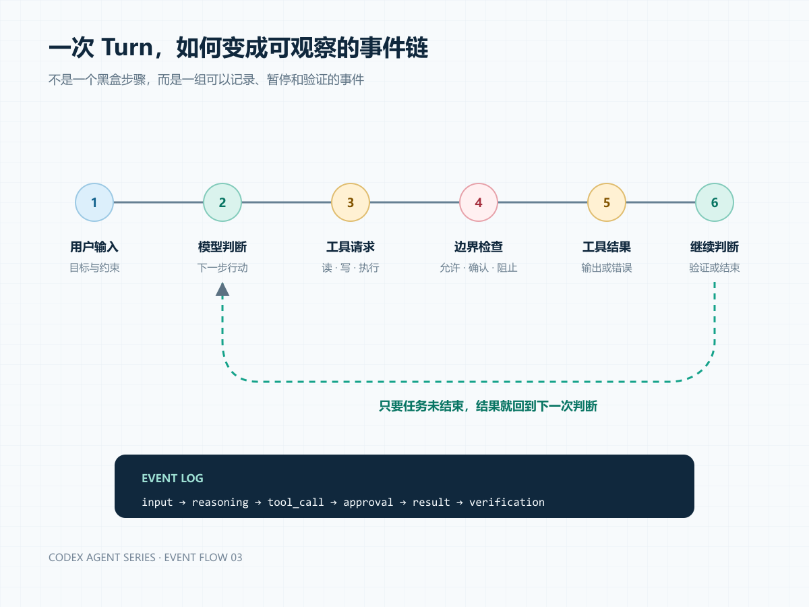
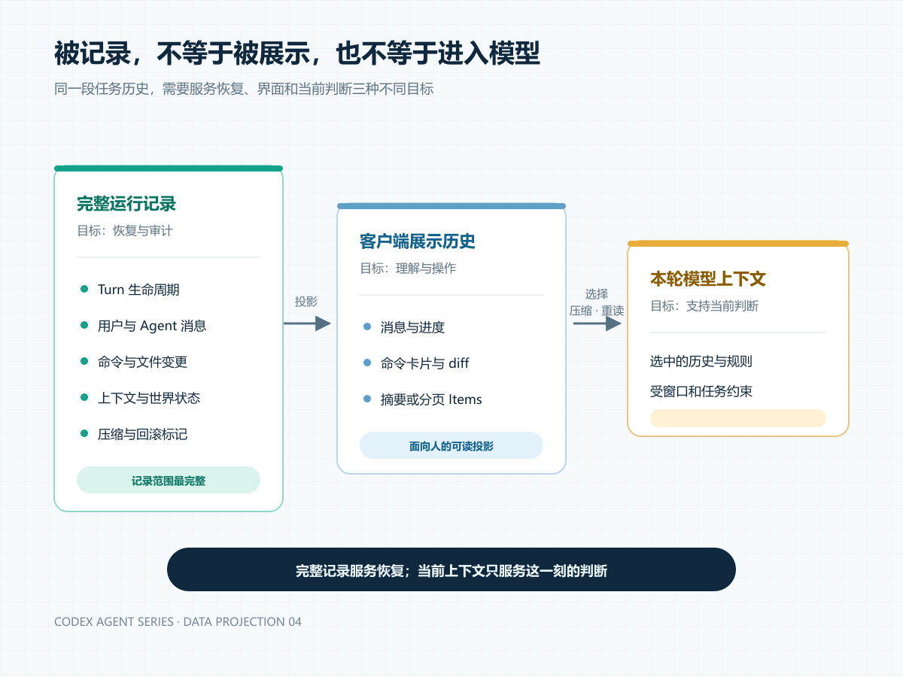
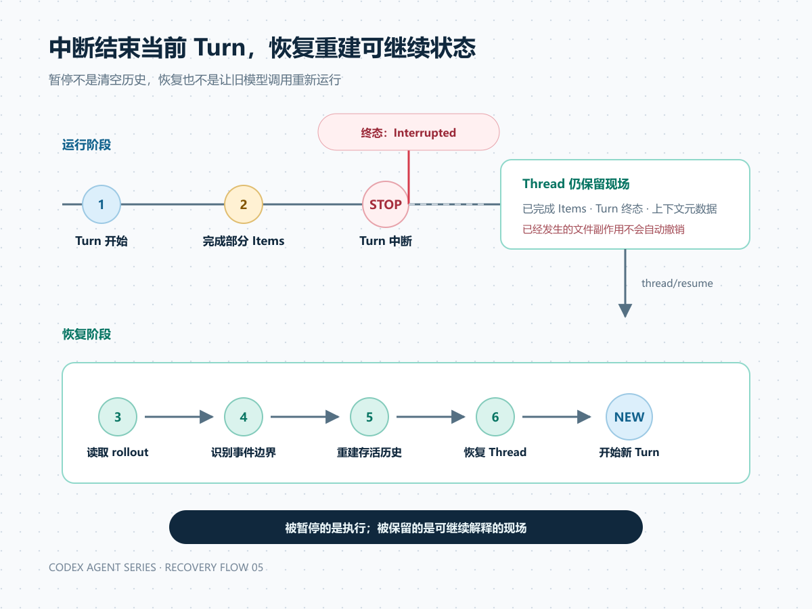

# Codex 保存的不是答案，而是一段可重放的执行历史

## 摘要

当你让 Codex 修改一个项目，任务可能经过读取文件、运行命令、申请确认、修改代码和执行测试。最后显示在对话框里的回复，只是这段过程的一个出口。

从 `openai/codex` 的公开协议和 Rust 运行层看，Codex 使用 Thread、Turn 和 ThreadItem 组织任务：Thread 维持连续工作的身份与环境；Turn 表示一次执行推进；Item 记录消息、命令、文件修改和工具结果。一次 Turn 内还可以发生多次模型判断。

更关键的是，完整运行记录并不等于某一轮送给模型的上下文。中断、恢复、压缩和回滚都需要运行系统根据持久化事件重新构造可继续工作的状态。

本文基于 `openai/codex` commit `7b5b3bd5a2418a5e142449c9ab95e057d14bc98a`。源码事实、架构推断和产品层未知边界会分别标明。

---

假设你给 Codex 一句话：

> 把配置中的超时时间改成 30 秒，运行相关测试，并说明是否还有风险。

如果这是普通问答，系统生成一段建议，工作就结束了。

但在代码 Agent 中，这句话可能触发一串动作：定位配置文件、读取项目规则、修改文件、执行测试、分析失败，再决定是否继续修复。中途还可能遇到权限确认，或者被用户打断。

问题随之改变：当最终回复还没有出现时，系统用什么表示“任务已经做到这里”？中断之后，它又凭什么继续？

先给结论：**Codex 保存的核心不是一段最终答案，而是一段有身份、有边界、有状态的执行历史。**

公开架构用三个层次组织这段历史：

- **Thread**：连续任务的容器。
- **Turn**：Thread 内的一次执行推进。
- **ThreadItem**：Turn 内可以被观察和记录的工作单元。

这三个词看起来像数据模型。真正值得理解的，是它们把一次 Agent 工作拆成了什么，以及这种拆法为中断、恢复和多客户端带来了什么。



*图 1：一次 Turn 可以包含输入、判断、工具动作、边界检查和结果回流。*

## 一、Thread 不是一串消息

很多人会自然地把 Thread 理解成聊天窗口。这个理解只覆盖了界面上最明显的一部分。

在 Codex app-server v2 协议中，`Thread` 除了 `id` 和 `turns`，还包含：

- session tree 和 fork/parent 关系；
- 是否为仅存在于内存中的 ephemeral thread；
- 历史存储模式；
- 当前运行状态；
- 工作目录；
- 创建它的 CLI 版本和入口来源；
- 可选的磁盘路径、Git 信息和项目归属。

源码位置：[`thread_data.rs` 的 `Thread`](https://github.com/openai/codex/blob/7b5b3bd5a2418a5e142449c9ab95e057d14bc98a/codex-rs/app-server-protocol/src/protocol/v2/thread_data.rs#L196)。

这组字段透露了一个重要边界。

聊天消息回答“说过什么”；Thread 还要回答“这段工作属于谁、在哪里运行、从哪个任务分叉、历史怎样保存、当前是否可继续”。

换句话说，Thread 更接近一个持续任务的身份与运行外壳，而不是消息列表的别名。

这里还有一个容易忽略的细节：`turns` 字段并不保证在每个 Thread 响应里都完整填充。源码注释明确说明，它只在 resume、rollback、fork，以及要求包含 Turns 的 read 响应中装载；其他响应可以返回空数组。

**源码事实**：Thread 可以存在，但当前响应不携带完整 Turn 历史。

**架构推断**：协议在区分“任务身份”和“历史投影”。客户端不必为了显示一个 Thread 列表，就加载全部执行记录。这为分页和远程存储留下了空间。

## 二、Turn 是一次执行推进，不是一次模型请求

再看 Turn。

公开协议中的定义很短：

```rust
pub struct Turn {
    pub id: String,
    pub items: Vec<ThreadItem>,
    pub items_view: TurnItemsView,
    pub status: TurnStatus,
    pub error: Option<TurnError>,
    pub started_at: Option<i64>,
    pub completed_at: Option<i64>,
    pub duration_ms: Option<i64>,
}
```

来源：[`thread_data.rs:350`](https://github.com/openai/codex/blob/7b5b3bd5a2418a5e142449c9ab95e057d14bc98a/codex-rs/app-server-protocol/src/protocol/v2/thread_data.rs#L350)。

`TurnStatus` 只有四种状态：`InProgress`、`Completed`、`Interrupted` 和 `Failed`。来源：[`turn.rs:30`](https://github.com/openai/codex/blob/7b5b3bd5a2418a5e142449c9ab95e057d14bc98a/codex-rs/app-server-protocol/src/protocol/v2/turn.rs#L30)。

从协议形状可以得到两个直接结论。

第一，Turn 有独立身份和生命周期。失败与中断不是最终文本里的自然语言描述，而是一等状态。

第二，Turn 包含多个 Items。它不是单条用户消息，也不是单条 Agent 回复。

但这还没有回答一个关键问题：Turn 是否等于一次模型 API 请求？

答案是否定的。

在 core 的 `RegularTask::run` 中，一个普通 Turn 先发出 `TurnStartedEvent`，然后进入 `run_turn`。而 `run_turn` 内部存在循环：记录输入、捕获当前 step context、从历史构造模型输入、请求模型、执行工具，再根据返回结果决定是否继续。

源码位置：[`regular.rs:39`](https://github.com/openai/codex/blob/7b5b3bd5a2418a5e142449c9ab95e057d14bc98a/codex-rs/core/src/tasks/regular.rs#L39) 与 [`session/turn.rs:301`](https://github.com/openai/codex/blob/7b5b3bd5a2418a5e142449c9ab95e057d14bc98a/codex-rs/core/src/session/turn.rs#L301)。

因此，一次用户可见的 Turn 可以包含：

```text
模型判断
  -> 请求工具
  -> 执行工具
  -> 结果写回历史
  -> 再次模型判断
  -> 继续执行或结束
```

这也是为什么把 Turn 翻译成“一轮模型调用”会产生误导。更准确的说法是：**Turn 是用户感知的一次任务推进边界，内部可以容纳多次模型与工具往返。**

## 三、Item 把过程变成可观察对象

如果 Thread 是持续任务容器，Turn 是一次推进，那么 Item 就是过程中具体发生的事情。

固定版本的 `ThreadItem` 是一个 tagged union，包括：

- `UserMessage`
- `AgentMessage`
- `Plan`
- `Reasoning`
- `CommandExecution`
- `FileChange`
- `McpToolCall`
- `DynamicToolCall`
- `CollabAgentToolCall`
- `ContextCompaction`

以及若干评审、图片和其他扩展 Item。

来源：[`item.rs:231`](https://github.com/openai/codex/blob/7b5b3bd5a2418a5e142449c9ab95e057d14bc98a/codex-rs/app-server-protocol/src/protocol/v2/item.rs#L231)。

Item 的价值不只是给动作起名字。

例如 `CommandExecution` 还保存命令、cwd、状态、聚合输出、退出码和耗时；`FileChange` 保存变更列表与应用状态。客户端因此可以区分“准备执行”“正在输出”“已经完成”“被拒绝”和“执行失败”。

app-server 把 Item 暴露成统一生命周期：

```text
item/started
  -> 零个或多个增量事件
  -> item/completed
```

官方仓库文档明确要求把 `item/completed` 视为该工作单元的权威结果。[app-server Events](https://github.com/openai/codex/blob/7b5b3bd5a2418a5e142449c9ab95e057d14bc98a/codex-rs/app-server/README.md#events)

这层设计让“过程”第一次有了稳定结构。界面不用解析一串混合日志，便可以分别渲染 Agent 消息、命令卡片、文件 diff 和审批状态。

**架构启示**：一个 Agent 系统想获得可观察性，不能只保存模型输出。它需要给真实世界中的动作分配 ID、状态、输入和结果，并定义开始与结束事件。

## 四、为什么 `turn/start` 返回时，工作才刚开始

沿调用链向下看，可以看到协议层怎样把用户输入交给运行层。

入口在 `MessageProcessor`。收到 `ClientRequest::TurnStart` 后，请求被交给 `TurnRequestProcessor::turn_start`。处理器会：

1. 加载目标 Thread；
2. 检查是否允许直接输入；
3. 校验输入大小；
4. 把 v2 输入转换为 core 输入；
5. 解析 cwd、环境、模型、审批和沙箱设置；
6. 调用 `CodexThread::start_or_steer_turn`。

调用链的源码入口分别位于 [`message_processor.rs:1440`](https://github.com/openai/codex/blob/7b5b3bd5a2418a5e142449c9ab95e057d14bc98a/codex-rs/app-server/src/message_processor.rs#L1440) 和 [`turn_processor.rs:478`](https://github.com/openai/codex/blob/7b5b3bd5a2418a5e142449c9ab95e057d14bc98a/codex-rs/app-server/src/request_processors/turn_processor.rs#L478)。

成功提交后，app-server 立即构造一个初始 Turn：

```rust
let turn = Turn {
    id: turn_id,
    items: vec![],
    items_view: TurnItemsView::NotLoaded,
    error: None,
    status: TurnStatus::InProgress,
    started_at: None,
    completed_at: None,
    duration_ms: None,
};
```

来源：[`turn_processor.rs:602`](https://github.com/openai/codex/blob/7b5b3bd5a2418a5e142449c9ab95e057d14bc98a/codex-rs/app-server/src/request_processors/turn_processor.rs#L602)。

这段代码很短，却说明了一个重要的异步边界：调用 `turn/start` 得到的不是完成结果，而是一个已经获得身份、正在推进的 Turn。

真实过程随后通过 `turn/started`、`item/*` 和 `turn/completed` 通知到达客户端。

如果把这套结构类比为提交构建任务，`turn/start` 返回的是 build ID，而不是构建产物。客户端拿到 ID 后订阅过程，直到收到明确终态。

## 五、运行记录、聊天历史和模型上下文不是同一件事

到这里很容易出现另一个误解：既然过程都被记录成 Items，那么下一次模型请求是不是会看见全部 Items？

不是。

Codex 的持久化 rollout 中可以包含多种记录：

- TurnStarted、TurnComplete、TurnAborted 等生命周期事件；
- UserMessage 等事件消息；
- TurnContext 与 WorldState；
- ResponseItem；
- compaction 与 rollback 标记。

但恢复时，系统不会把这些内容原样全部塞回模型。

`reconstruct_history_from_rollout` 会先逆序扫描 rollout，识别 Turn 边界、压缩检查点和回滚标记；再正向重放存活的历史尾部。真正进入 `ContextManager` 的，是经过选择与变换的模型历史项。生命周期事件则主要用于划分、恢复和配置。

来源：[`rollout_reconstruction.rs:114`](https://github.com/openai/codex/blob/7b5b3bd5a2418a5e142449c9ab95e057d14bc98a/codex-rs/core/src/session/rollout_reconstruction.rs#L114)。



*图 2：完整记录服务恢复与审计；本轮模型上下文只服务当前判断。*

可以把这三个集合区分开：

### 运行记录

保存任务发生过什么，包含生命周期、环境、工具结果和恢复元数据。

### 客户端展示历史

从运行记录投影出适合用户查看的消息、命令、diff 和状态。它可以只加载摘要，也可以分页读取完整 Items。

### 模型当前上下文

为下一次判断准备的输入。它会受到上下文窗口、压缩、工具结果处理和当前任务需要的影响。

**源码事实**：三者使用不同的数据类型与重建路径。

**合理推断**：这种分离可以让系统同时满足审计、UI 性能和模型输入预算三个目标。代价是状态不再只有一份，系统必须处理投影一致性和版本兼容。

下一篇会专门讨论“什么进入模型上下文”。本篇先保留这个边界：**被系统记录，不等于本轮已经被模型看见。**

## 六、中断为什么不是删除最后一条消息

现在回到开头的问题：任务执行到一半，用户点击停止，系统保存了什么？

在公开协议中，中断不是删除一段流式文本，而是针对活动 Turn 的控制动作。

`turn_interrupt_inner` 会校验传入的 `turn_id` 是否等于当前活动 Turn。如果不匹配，返回错误；如果已经没有活动 Turn，也拒绝中断。校验成功后，处理器登记 pending interrupt，并向 core 提交 `Op::Interrupt`。

来源：[`turn_processor.rs:1474`](https://github.com/openai/codex/blob/7b5b3bd5a2418a5e142449c9ab95e057d14bc98a/codex-rs/app-server/src/request_processors/turn_processor.rs#L1474)。

客户端不能只看 interrupt 请求是否发送成功。官方 app-server 文档要求等待最终的 `turn/completed`，其状态为 `interrupted`，才知道中断已经完成。

这有三个架构含义。

第一，中断有明确目标，不能模糊地“停掉最近的任务”。这避免并发状态下误杀另一个 Turn。

第二，中断是 Turn 的终态之一，因此恢复和 UI 都能区分“用户主动停止”与“运行失败”。

第三，中断不会自动撤销已经发生的外部副作用。文件可能已经修改，后台终端也可能仍存在。Turn 是执行边界，但不是能回滚所有外部系统的数据库事务。

## 七、恢复不是打开旧对话，而是重建可继续状态

当 app-server 重启后调用 `thread/resume`，系统会先检查 Thread 是否仍在运行；否则从显式 history 或持久化 stored thread 加载记录。

接下来，core 根据 rollout 重建模型历史和恢复元数据。

其关键代码不是简单的 `load(messages)`。重建器会识别：

- `TurnComplete`：正常终止边界；
- `TurnAborted`：中断边界；
- `TurnStarted`：一个 Turn 的起点；
- `UserMessage`：是否计作用户 Turn；
- `TurnContext`：上一轮设置与参考上下文；
- `Compacted`：替换历史的检查点；
- `ThreadRolledBack`：应跳过的新近用户 Turns。



*图 3：中断结束当前 Turn；恢复读取持久化事件，重建可继续状态。*

从架构师视角看，这是一种事件重放思路：历史记录不是最终状态的唯一快照，而是重建状态的证据。

它的收益是：

- 可以解释状态如何形成；
- 可以区分完成、中断和失败；
- 可以在压缩或回滚后重建存活历史；
- 多种客户端可以消费同一套任务语义。

它的成本也很具体：

- 需要维护事件版本与兼容性；
- 恢复逻辑必须处理不完整 Turn 和旧格式；
- 大型历史需要压缩、分页或检查点；
- UI 历史、持久化记录和模型上下文之间可能出现投影差异。

替代设计是只保存最新上下文快照。它恢复得更直接，却会丢失许多过程证据，也很难回答“这个状态是怎样形成的”。

我们不能仅凭源码断言项目作者的全部设计意图。但从公开协议和重建路径可以合理推断：Codex 选择承担更复杂的历史管理，是为了换取可观察、可中断和可恢复的任务过程。

## 八、做一个最小实验：亲眼看见 Turn 和 Items

如果你希望验证本文，而不是只接受源码解释，可以直接观察 app-server 的事件流。

准备一个临时目录，给 Codex 一个三步任务：

```text
创建 note.txt，写入 hello，然后读取文件确认内容。
```

通过 app-server 依次执行：

1. 建立连接并完成 initialize；
2. 调用 `thread/start`；
3. 调用 `turn/start`；
4. 持续记录 JSON-RPC 通知；
5. 按 `threadId`、`turnId` 和 `item.id` 分组。

重点不要放在文件是否成功创建，而要检查：

- `turn/start` 的初始响应是否为 InProgress；
- 一个 Turn 内出现了哪些 Items；
- Item 是否经历 started、delta 和 completed；
- 最终 Turn 是 completed、interrupted 还是 failed；
- 命令或文件修改的结果是否保存在对应 Item 中。

再做第二次实验：在 Turn 运行中发送 `turn/interrupt`，等待 `turn/completed(status=interrupted)`，重启 app-server 后调用 `thread/resume`。

你会更直观地看到：停止的是当前 Turn，保留下来的是 Thread 中已经记录的现场；继续工作并不是让旧模型调用复活，而是在重建状态上继续推进。

## 九、从代码到架构：这一层模型解决了什么

把以上源码放在一起，调用链可以压缩为：

```text
turn/start
  -> 协议校验与设置解析
  -> CodexThread 输入路由
  -> RegularTask 建立 Turn 生命周期
  -> run_turn 多步执行循环
  -> ThreadItem 增量事件
  -> Turn 终态
  -> rollout 持久化与恢复重建
```

它解决的不是“怎样让模型回答更聪明”，而是另外四个工程问题。

### 1. 身份

每段连续工作、每次推进和每个动作都有稳定 ID，异步事件可以被准确归属。

### 2. 可观察性

客户端能在最终回复之前看见命令、修改和审批，并获得权威终态。

### 3. 控制

运行系统可以对具体 Turn 中断，对具体 Item 做审批，而不是只有“继续聊天”与“关闭应用”两个选项。

### 4. 恢复

任务状态能从持久化记录重建，而不是依赖某个常驻进程一直存活。

这也是本文与普通产品介绍最重要的区别：Thread、Turn、Item 不是三个方便记忆的名词，而是一组责任边界。它们共同把模型输出包进一个可以被软件系统管理的执行过程。

## 常见误区

### 误区一：Thread 就是聊天记录

Thread 还携带运行状态、工作目录、来源、fork 关系和历史装载策略。消息只是其中一种内容。

### 误区二：一个 Turn 就是一次模型调用

一个 Turn 可以包含多次采样、工具执行和结果回流。Turn 是用户感知的工作边界。

### 误区三：所有记录都会进入下一次模型上下文

生命周期事件、恢复元数据和模型历史承担不同职责。完整记录不等于当前 prompt。

### 误区四：中断会撤销已经发生的修改

中断让 Turn 进入 Interrupted 状态，不承诺回滚文件系统或停止所有后台进程。

### 误区五：公开源码证明了桌面端的全部实现

本文证据覆盖公开 app-server 与 Rust core。ChatGPT/Codex 桌面端的私有服务层、存储后端和 UI 投影仍有未确认边界。

## 本篇结论

一句请求进入 Codex 后，系统建立的不是单纯的回答上下文，而是一段分层的执行历史：

- Thread 保存连续任务的身份、环境和历史边界；
- Turn 表示一次有明确终态的执行推进；
- ThreadItem 把消息、命令、修改和工具调用变成可观察工作单元；
- rollout 为中断、压缩、回滚和冷恢复保留重建依据；
- 模型当前上下文只是这段历史的一种受约束投影。

模型能力决定单次判断的质量；运行状态模型决定这些判断能否被组织成可继续、可接管的工程过程。

## 下一篇预告

运行系统可以保存大量记录，但模型每次判断能使用的信息仍然有限。

下一篇将继续向内追：仓库文件、`AGENTS.md`、用户输入、工具结果和历史事件，哪些会进入本轮上下文？当内容变长时，Codex 如何在读取、选择、压缩和重建之间做取舍？

那一篇要回答的问题是：**上下文不是仓库镜像，Agent 到底怎样决定什么值得进入判断。**
