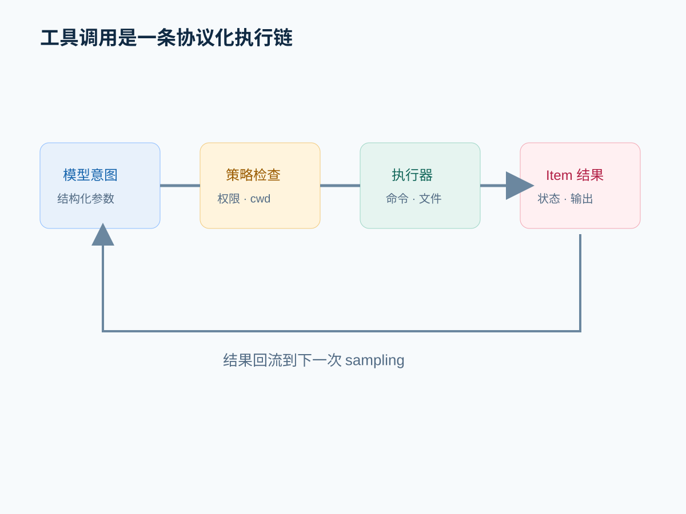
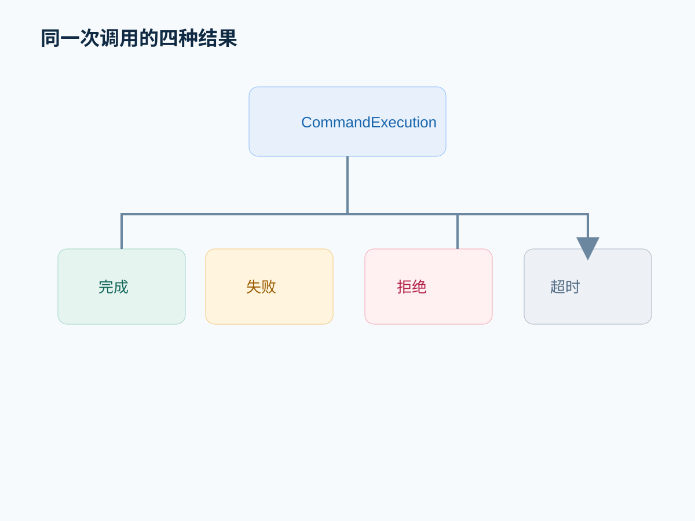

# 模型不会直接操作环境：工具层如何把判断变成动作

## 摘要

“Agent 会改代码”是一种方便但不精确的说法。模型产生的是结构化行动意图，运行层负责校验、授权、执行和结果回流。本文从工具 Item、Turn 循环和命令/文件变更事件解释这条边界。

## 先给结论

**Agent 的行动能力来自判断、调度、执行和回流组成的闭环，而不是工具数量。** 运行层把模型输出翻译成受控动作，再把成功、失败、拒绝或部分结果放回下一次判断。

## 一、工具调用是一种协议事件

公开 `ThreadItem` 包含 `CommandExecution`、`FileChange`、`McpToolCall` 和 `DynamicToolCall`。它们都有独立 ID 和状态，不是混在 Agent 文本里的动词。

来源：[item.rs](https://github.com/openai/codex/blob/7b5b3bd5a2418a5e142449c9ab95e057d14bc98a/codex-rs/app-server-protocol/src/protocol/v2/item.rs#L276)。命令执行 Item 还保存 cwd、聚合输出、退出码和耗时；文件变更 Item 保存变更列表与应用状态。

这意味着客户端可以在动作结束前显示进度，也可以在动作被拒绝时保留一个明确结果。

## 二、一次动作的控制流

```text
模型请求
  -> 参数解析
  -> 工具/权限策略检查
  -> 执行器
  -> stdout、diff 或错误
  -> item/completed
  -> 结果写入历史
  -> 下一次模型判断
```

`run_turn` 的循环在 sampling request 后继续处理工具结果，直到没有待处理输入或任务终止。它把“模型判断”和“现实动作”放在两个不同责任层。

## 三、从代码到架构

`turn/start` 在 app-server 层先把 v2 输入映射为 core 输入，再交给 `CodexThread::start_or_steer_turn`。这条边界让入口层不需要理解每个工具的执行细节。

架构收益是扩展性：添加工具主要需要实现适配器、参数和 Item 投影，不必让 CLI、IDE 和桌面入口各自重写任务循环。代价是协议、适配器、权限和错误归一化变复杂。

如果直接让模型输出 shell 字符串并由客户端执行，初期简单，但客户端将承担安全、状态、超时和结果解析，最终会出现多个不一致的执行器。

## 四、错误路径比成功路径更能说明问题

同一调用可能产生四种结果：完成、失败、拒绝和超时。它们对下一步判断不同：失败可能需要修复参数，拒绝可能需要缩小权限，超时需要换方案，完成才进入验证。

文章不能只展示一条绿色成功链，否则会把“能调用工具”误写成“可靠执行”。

## 五、实验：记录一次修复任务的工具链

准备一个带失败测试的项目，要求 Codex 定位并修复。记录每个 Item 的：

- 工具名称与参数；
- 输入文件和 cwd；
- 结果状态；
- 是否产生文件 diff；
- 结果如何影响下一次动作。

再人为制造一个参数错误，比较 Agent 是修正参数、请求输入还是重复失败。

## 常见误区

- 工具越多，Agent 就越强。
- 模型可以直接访问文件系统。
- 工具调用成功就代表用户目标完成。
- 并行执行所有动作一定更快。

## 本篇结论

工具层的价值在于把模型判断放入一个有权限、有状态、有结果的执行协议。没有这层，模型只能给建议；有了但没有边界，动作风险又会失控。

## 下一篇预告

工具可以执行动作，但复杂任务还需要决定顺序和阶段。下一篇讨论计划如何作为外部控制状态，让任务可以被校正。

## 源码与架构补充

研究记录见 [`research/episode-03-research.md`](../research/episode-03-research.md)。`CommandExecution`、`FileChange` 和 MCP 调用都是带状态的 Item；模型只提交结构化意图，app-server/core 负责权限、执行、结果归一化和事件回流。




