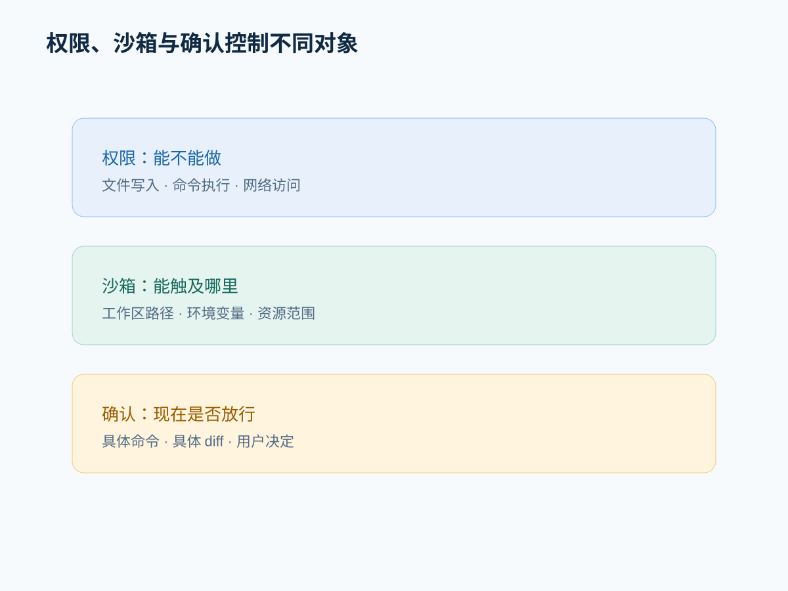
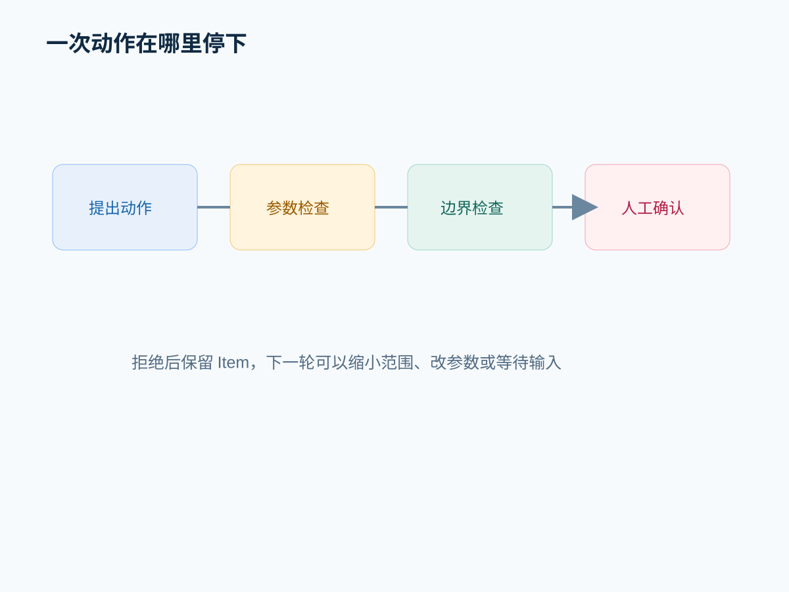

# Agent 为什么会停下来：权限、沙箱与确认控制的不是同一件事

## 摘要

Agent 要进入真实项目，必须面对文件、命令、网络和外部副作用。权限、沙箱和人工确认共同构成边界，但它们控制的对象不同。

## 先给结论

**权限决定能力，沙箱决定范围，确认决定具体动作何时放行。** 三者不能互相替代。安全设计的目标不是让 Agent 什么都做不了，而是让每次能力升级都可解释、可审计、可撤回。

## 一、从 Turn settings 看边界进入系统的位置

`turn/start` 会解析 approval policy、sandbox policy、permissions、cwd 和 environment settings，再把它们交给 core。源码位置：[turn_processor.rs](https://github.com/openai/codex/blob/7b5b3bd5a2418a5e142449c9ab95e057d14bc98a/codex-rs/app-server/src/request_processors/turn_processor.rs#L534)。

这说明边界配置不是某个按钮的局部行为，而是 Turn 的运行设置。

## 二、三层边界

### 权限

描述 Agent 能否使用某种能力，例如写文件、执行命令或访问网络。

### 沙箱

限制动作实际能触及的路径、环境和系统资源。

### 人工确认

在某个具体高影响动作发生前，把决定交给人。

一个动作可能具备能力但被沙箱限制，也可能在沙箱范围内仍需要确认。

## 三、从代码到架构

把边界统一放在运行层，可以保证不同工具遵循同一套策略，并让审批事件归属于 Thread/Turn/Item。代价是权限策略成为跨平台抽象，必须处理旧配置、实验字段和用户体验。

替代方案是每个工具自己判断权限。短期灵活，长期容易出现命令工具允许而文件工具拒绝的策略裂缝。

## 四、拒绝路径

一次动作可能在三处停止：请求参数不合法、策略不允许、用户拒绝。它们不应都显示成“执行失败”，因为下一步不同：修正参数、缩小任务或等待用户决定。

## 五、实验：逐步升级动作

依次执行只读文件、工作区内写入、工作区外路径和外部网络动作，记录每一步：

- 哪一层允许或阻止；
- 是否出现审批；
- 拒绝后是否保留 Item；
- 是否能改写成只读替代方案。

## 常见误区

- 确认框意味着没有沙箱。
- 任务开头的授权可以覆盖所有后续高影响动作。
- 权限被拒时不断重试同一请求。
- 为了减少打断而永久扩大权限。

## 本篇结论

好的边界设计让 Agent 在“能做、该做、现在做”之间分别做出判断。安全不是执行链之外的警告，而是执行链中的状态。

## 下一篇预告

动作被允许并不意味着目标完成。下一篇讨论测试、构建、行为检查和人工验收如何组成验证闭环。

## 源码与架构补充

研究记录见 [`research/episode-05-research.md`](../research/episode-05-research.md)。`turn/start` 将 approval、sandbox、permissions 和 cwd 作为 Turn 级设置传入 core，并拒绝互斥配置。权限、沙箱和确认分别控制能力、作用范围与放行时机。

