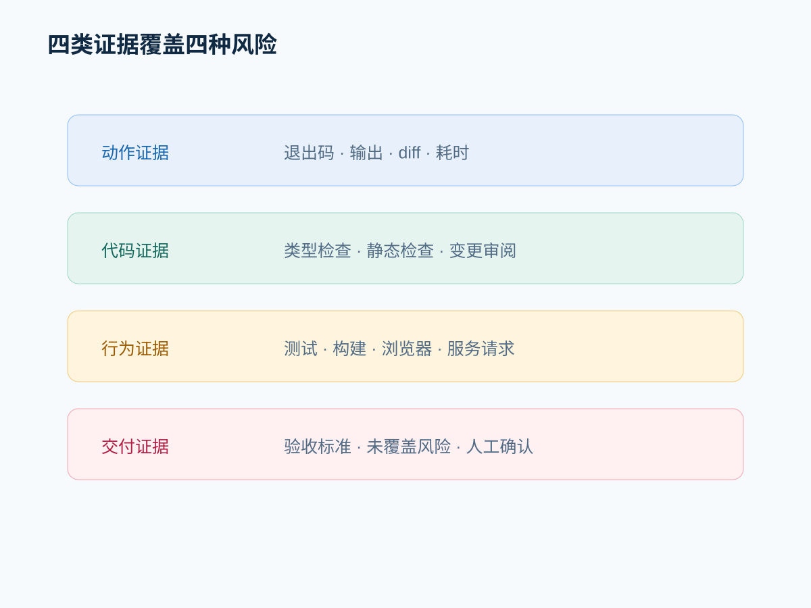
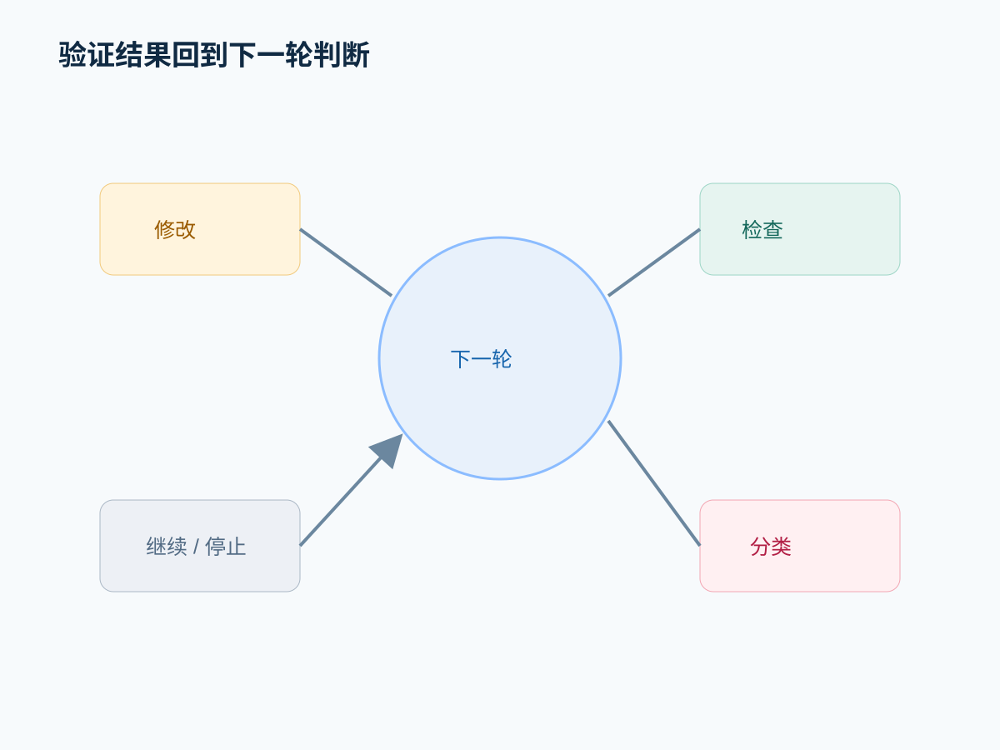

# 修改成功只是执行结果：验证如何把 Agent 拉回现实

## 摘要

命令退出码为零、文件成功写入、diff 能够应用，都只能证明动作发生了。任务是否完成，还需要把用户目标转换成分层证据。

## 先给结论

**执行结果证明“做了什么”，验证证据才回答“是否满足目标”。** 验证应从语法和类型开始，经过测试和构建，最后覆盖真实行为与人工验收。

## 一、四种证据

- 动作证据：命令执行、文件修改和退出状态。
- 代码证据：diff、类型检查、静态检查。
- 行为证据：测试、构建、浏览器交互或服务请求。
- 交付证据：验收标准逐项核对以及未覆盖风险。

`CommandExecution` Item 保存退出码、输出和耗时，`FileChange` 保存变更状态。这些字段让动作证据可见，但不会自动生成行为证据。

来源：[item.rs](https://github.com/openai/codex/blob/7b5b3bd5a2418a5e142449c9ab95e057d14bc98a/codex-rs/app-server-protocol/src/protocol/v2/item.rs#L276)。

## 二、验证如何进入下一次判断

```text
修改
  -> 运行检查
  -> 结果分类
  -> 继续、修复或停止
  -> 新一轮模型判断
```

测试失败不是最终答案，而是新的输入。反过来，未运行某项检查也应该进入最终说明，而不是被省略。

## 三、从代码到架构

通用命令工具的好处是适配各种项目，不需要 Agent 预先理解所有测试框架；代价是运行层只能获得退出码和文本，无法自动理解业务语义。因此验收标准仍需由项目规则、用户输入或专用工具提供。

替代方案是建立统一验证引擎，输出结构化质量结论。它更易审计，但难覆盖异构仓库，且会把大量项目约定硬编码进平台。

## 四、实验：前端窄屏问题

准备一个类型检查通过、单元测试通过、但窄屏溢出的页面。要求 Agent 修复并分别运行类型检查、测试、生产构建和浏览器截图检查。

实验要记录每种验证排除了什么风险，也记录没有覆盖什么风险。

## 常见误区

- 工具成功等于任务成功。
- 只运行最方便的一条测试命令。
- 测试失败后直接删除或放宽测试。
- 最终回复不区分已运行、未运行和失败的验证。

## 本篇结论

验证不是文章末尾的装饰，而是让 Agent 从“执行者”变成“可交付系统”的反馈机制。

## 下一篇预告

验证循环不一定收敛。下一篇讨论错误、取消、超时和外部改动出现时，Agent 如何恢复或清楚交接。

## 源码与架构补充

研究记录见 [`research/episode-06-research.md`](../research/episode-06-research.md)。执行 Item 的退出码、输出、耗时与 FileChange 状态构成动作证据；turn 级 diff 便于展示全量变更，但仍需项目测试和人工验收补足业务证据。




