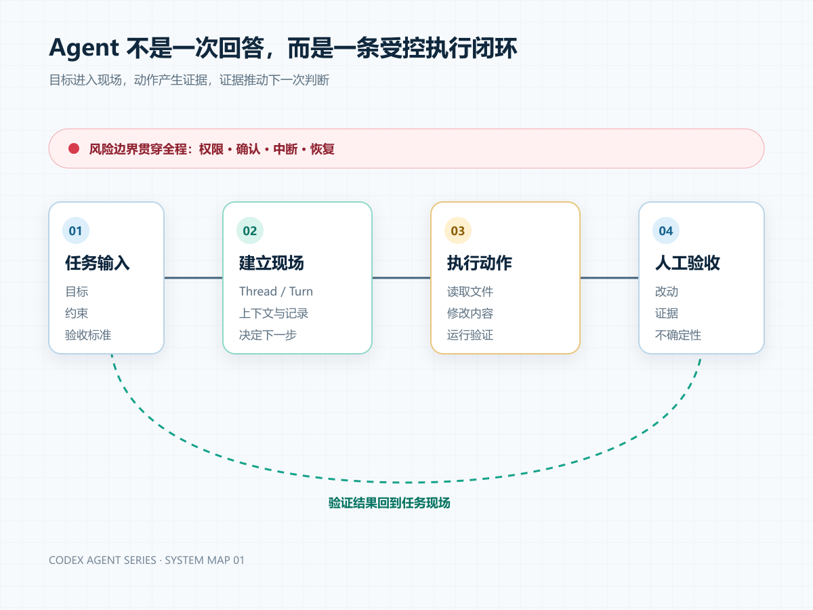

# Agent Research

一组从产品现象、原始代码、运行时调用链和架构取舍出发，理解 Codex Agent 机制的中文文章。

## 系列路线

`任务状态 → 上下文 → 工具动作 → 计划控制 → 权限边界 → 验证闭环 → 失败恢复 → 子代理协作`

## 已发布

### 第一篇：Codex 保存的不是答案，而是一段可重放的执行历史

从 `Thread`、`Turn`、`ThreadItem` 的协议定义出发，追踪：

- `turn/start → CodexThread → RegularTask → run_turn` 调用链
- Item 的流式生命周期和可观察状态
- 运行记录、界面历史与模型上下文的边界
- Turn 中断、rollout 重建和冷恢复
- 事件模型的架构收益、成本与替代设计

[阅读第一篇](articles/01-execution-history.md)

## 研究原则

- 源码事实、架构推断和未知边界分开记录。
- 每个关键结论绑定仓库版本、文件路径和符号。
- 每篇至少包含一个可复现实验。
- 配图用于解释机制，不用于装饰。

源码仓库：[`openai/codex`](https://github.com/openai/codex)
